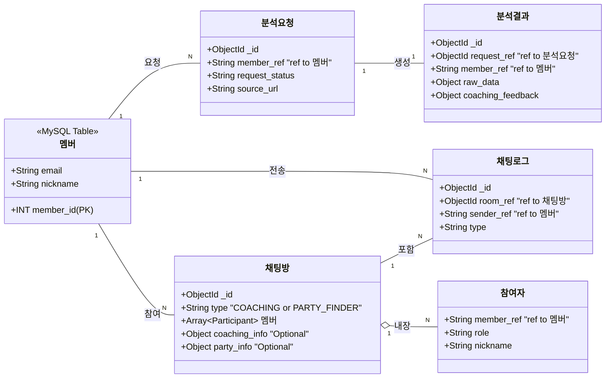

```mermaid
classDiagram
    direction LR

    %% --- External RDB Table (for Reference) ---
    class 멤버 {
        <<MySQL Table>>
        +INT member_id (PK)
        +String email
        +String nickname
    }

    %% --- MongoDB Collections ---

    class 분석요청 {
        +ObjectId _id
        +String member_ref "ref to 멤버"
        +String request_status
        +String source_url
    }

    class 분석결과 {
        +ObjectId _id
        +ObjectId request_ref "ref to 분석요청"
        +String member_ref "ref to 멤버"
        +Object raw_data
        +Object coaching_feedback
    }

    class 채팅방 {
        +ObjectId _id
        +String type "COACHING or PARTY_FINDER"
        +Array~Participant~ 멤버
        +Object coaching_info "Optional"
        +Object party_info "Optional"
    }

    class 채팅로그 {
        +ObjectId _id
        +ObjectId room_ref "ref to 채팅방"
        +String sender_ref "ref to 멤버"
        +String type
    }

    %% --- Embedded Documents ---

    class 참여자 {
        +String member_ref "ref to 멤버"
        +String role
        +String nickname
    }

    %% --- Relationships ---

    멤버 "1" -- "N" 분석요청 : 요청
    멤버 "1" -- "N" 채팅방 : 참여
    멤버 "1" -- "N" 채팅로그 : 전송

    분석요청 "1" -- "1" 분석결과 : 생성

    채팅방 "1" -- "N" 채팅로그 : 포함
    채팅방 "1" o-- "N" 참여자 : 내장

```
